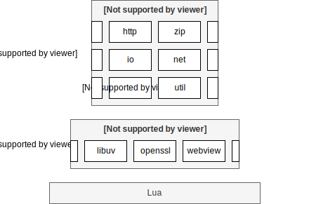

## What is luajls?

luajls is a set of Lua modules for developing stand-alone [Lua](https://www.lua.org/) applications.

The modules provide general-purpose functions such as class definition and promise, to operating system abstractions such as file system and network access.
The modules support asynchronous I/O based on event loops.



The main targeted operating systems are Linux and Windows.

## What are the features?

luajls provides:
* language basics such as class definition, module loading, logging, promise, event loop, threads, processes
* file system manipulation, I/O, file and networking access, serial communication, pipe, streams
* HTTP, WebSocket, MQTT client and server with support for secured communication using SSL
* utility modules for List and Map, date and time, JSON and XML formats, deflate, ZIP and tar files, scheduling, worker and web view

## What does it look like?

The following is the hello world HTTP server script.

```lua
local event = require('jls.lang.event')
local HttpServer = require('jls.net.http.HttpServer')

local hostname, port = '::', 8080
local httpServer = HttpServer:new()
httpServer:bind(hostname, port):next(function()
  print('Server bound to "'..hostname..'" on port '..tostring(port))
end)
httpServer:createContext('/', function(httpExchange)
  local response = httpExchange:getResponse()
  response:setBody([[<!DOCTYPE html>
  <html>
    <body>
      <p>It works !</p>
    </body>
  </html>
  ]])
end)
event:loop()
```

## How to install and use it?

Just drop the *jls* folder in your Lua path.

The only required dependency is Lua 5.4.
Optional dependencies are C-based or plain Lua modules such as *luafilesystem*, *luasocket*, *luv*, *lua-openssl*, *lua-cjson*.
By example, the file system manipulation requires one of the *luafilesystem* or the *luv* dependent module.
The recommended dependency is *luv* as you will have access to the full *io*, *lang* and *net* packages.

Lua, luajls and all the dependencies are available in the [Lua C libraries repository](https://github.com/javalikescript/luaclibs).

As luajls is composed of Lua modules, you need to adapt the environment variables *LUA_PATH* and *LUA_CPATH* to include the luajls home directory.

luajls is also available on [LuaRocks](https://luarocks.org/modules/javalikescript/luajls).


## What do you want to do?

Browse the [examples](https://github.com/javalikescript/luajls/tree/master/examples)
or applications such as [Fast Cut](https://github.com/javalikescript/fcut) and [Light Home Automation](https://github.com/javalikescript/lha).

Read the [user manual](https://github.com/javalikescript/luajls/blob/master/doc_topics/manual.md) or the [API documentation](https://javalikescript.github.io/luajls/).

Download [binaries](https://github.com/javalikescript/luajls/releases/latest) or access the [source code](https://github.com/javalikescript/luajls).
